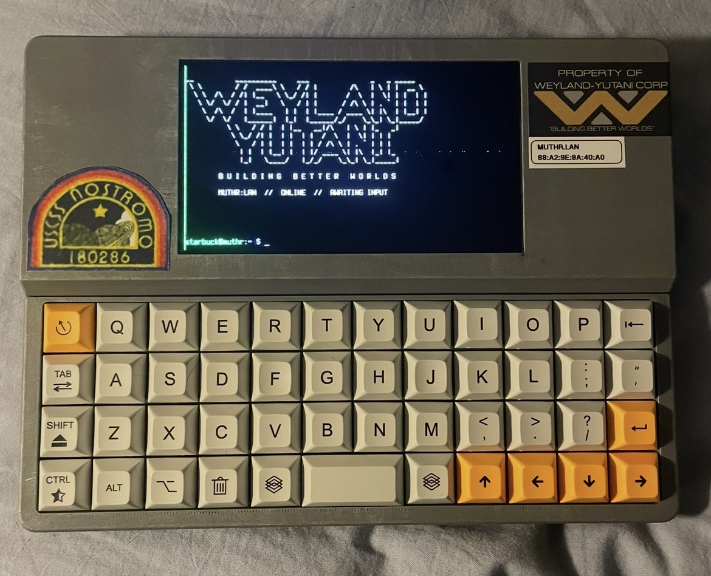

# Bee Write Back (MUTHR Edition)

**A Weyland-Yutani-inspired writerdeck. Detached fork of [bee-write-back](https://github.com/shmimel/bee-write-back) by shmimel.**

-----

## Introduction

This is MUTHR — a personal terminal built on the Bee Write Back platform, themed after the Weyland-Yutani Corporation from the *Alien* universe.

MUTHR is built for three things:

- **Journaling and writing** — distraction-free, the same core use case as the original bee-write-back
- **Claude chat terminal** — a dedicated IRC-style AI interface
- **Scripting and network analysis** — lightweight Python scripting and network tooling

The original bee-write-back project gave this a great foundation. All credit to [shmimel](https://github.com/shmimel) for the hardware design and core software — go check out [the original repo](https://github.com/shmimel/bee-write-back) and build guide if you want to build your own.

-----

## What’s Different From bee-write-back

- **Weyland-Yutani aesthetic** — terminal UI styled after the retro-futuristic displays from the *Alien* franchise; green-on-black, monospace font, amber section headers, corporate timestamps
- **Screensaver** — an engineering readout screen displaying ship systems status (and a secret rare message)
- **Extended software** — adds network analysis and Python scripting tooling alongside the original journaling and Claude chat functions
- **Case modifications** — Some hardware changes and additions (to be documented)

-----

## Hardware

The core hardware follows the original bee-write-back design. Key differences for this build:

- **Aluminum backplate:** To be documented
- **Power indicator/keyboard light:** To be documented
- **Onboard speaker:** To be documented
- **Ethernet port:** To be documented

For the original build guide, BOM, and CAD files, refer to the [bee-write-back repo](https://github.com/shmimel/bee-write-back).

-----

## Software

MUTHR runs three virtual terminals:

1. **Standard terminal** — general use, scripting, network tooling
1. **Claude chat** — dedicated IRC-style Claude chat client
1. **Journal** — distraction-free writing (To be updated, currently same as the original bee-write-back implementation)

The UI is a green-on-black terminal interface built to evoke the aesthetic of Weyland-Yutani ship systems. Software details and setup instructions (including system-specific configuration) will be documented fully at v1.0.

-----

## Status

This build is currently in progress. The case and core software are complete. Keyboard installation and final assembly are pending — full documentation will follow at v1.0.

-----

## Credits

Bee-Write-Back (MUTHR Edition) is a detached fork of [bee-write-back](https://github.com/shmimel/bee-write-back) by shmimel. The hardware design, original software, and core concept are his work. Go build one.

-----

## License

Refer to the original [bee-write-back license](https://github.com/shmimel/bee-write-back). All modifications in this fork are shared in the same spirit.

-----

*MUTHR is nominal. All systems stable.*

*2026.04.27 // WEYLAND-YUTANI CORP.*
